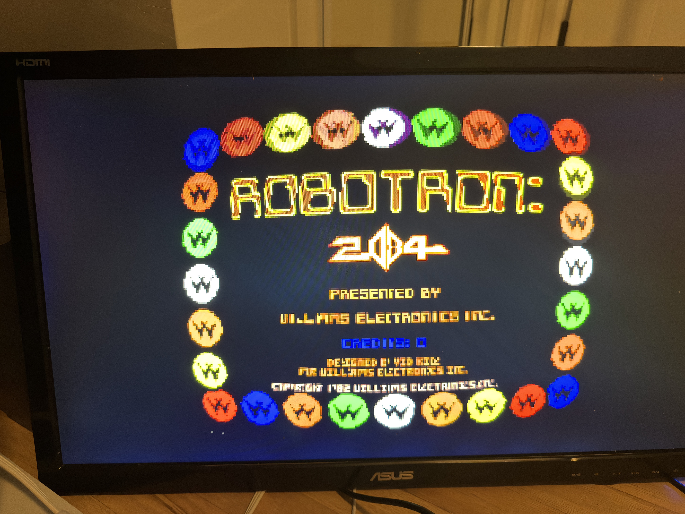
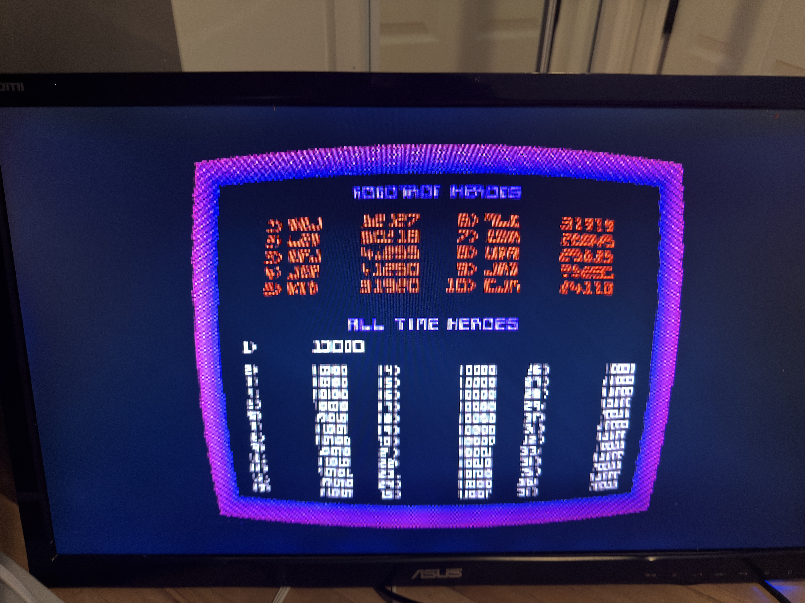

# Arcade-Robotron_MiSTer-VIS

vis_warp-enabled fork of [`MiSTer-devel/Arcade-Robotron_MiSTer`](https://github.com/MiSTer-devel/Arcade-Robotron_MiSTer).

**This is the first validated consumer core for vis_warp** — barrel-warp
working symmetrically on a real arcade game, on hardware. The framework
lives at the [vis_warp framework repo](https://github.com/derpyder/misterfpga_vis_warp); start
there for the architecture, the adoption pipeline (`ADOPTING-A-CORE.md`),
and the roadmap.

## On hardware

| Title screen — barrel warp | High-score screen — warp + CRT shadowmask |
|---|---|
|  |  |

Left: the coin border and title bow symmetrically under the barrel warp
(native 4:3, self-tuning sync-delay — full top-to-bottom symmetry). Right:
the same warp with a CRT shadowmask stacked downstream — the mask border
curves *with* the tube. Shot on a DE10-nano over HDMI.

## What's different from upstream Robotron

- `sys/` carries the vis_warp framework files (`vis_warp.vhd`,
  `vis_warp_v2_wp.vhd`, `vis_warp_pkg_v2.vhd`, `vis_warp_luts_pkg.vhd`).
- `sys/sys_top.v` has the SITE C insertion under `` `ifdef MISTER_WARP ``:
  vis_warp sits before `VGA_scanlines`, warping the native source; the
  warped frame then flows through scanlines → ascal → HDMI.
- `Arcade-Robotron.qsf` defines `MISTER_WARP=1`.
- Dev-time warp defaults in `sys/vis_warp.vhd`: enabled, curvature k=2,
  bilinear on.

With `MISTER_WARP` unset, the build is bit-identical to upstream Robotron.

## Why Robotron works (where Galaga didn't)

Robotron is a **landscape** Williams game: `landscape=1` forces
`no_rotate=1`, so the `screen_rotate` DDR-framebuffer path stays dormant
and ascal reads its **live input** — exactly where SITE C vis_warp sits.
Vertical/rotated cores (Galaga) divert video through the framebuffer and
bypass the live input; Robotron doesn't. (Full rationale in the
framework's `design_vis_warp_constraints.md` / `ADOPTING-A-CORE.md`.)

The same core also runs Joust, Stargate, Bubbles, Splat, and Alien★ar —
all `landscape=1`, all warp-able from this one build. (Sinistar and
Playball are `landscape=0` = rotated = the bypassed class.)

## Status

| | |
|---|---|
| Compiles clean (MISTER_WARP=1) | ✅ |
| Symmetric barrel on hardware (native 4:3) | ✅ validated 2026-05-28 |
| Self-tuning sync-delay (no per-core constant) | ✅ |
| Pre-built `.rbf` released | ⏳ (build from source for now) |

**Known, NOT a vis_warp issue:**
- **Twin-stick controls** — mapping the right stick to fire is stock-core
  behaviour (vis_warp never touches input). Use the OSD **Control** option
  to route the second stick as fire, and map your right analog stick to
  the P2 directions in MiSTer's controller config. Same on vanilla
  Robotron.
- **HDMI**: leave the front-end **scandoubler OFF** — ascal scales the
  warped native frame. Scandoubler ON feeds vis_warp doubled lines it
  can't fully reach (resolution-gated bow). Native + ascal is the path.
- **Top-of-frame**: fully symmetric now (self-tuning sync-delay); no
  residual asymmetry on this core.

## Install — no Quartus needed (the easy way)

**Everything is pre-named to just work. You do NOT rename anything.** The
core's filename and the MRAs' `<rbf>` tag already match.

### 1. Grab these from this repo's [`releases/`](./releases) folder

- **`RobotronVIS_20260528.rbf`** ← the vis_warp core
- the **`… (vis_warp).mra`** file(s) for the game(s) you want:
  `Robotron 2084 (vis_warp).mra`, `Joust (vis_warp).mra`,
  `Stargate (vis_warp).mra`, `Bubbles (vis_warp).mra`,
  `Splat! (vis_warp).mra`, `Alien Arena (Stargate upgrade) (vis_warp).mra`

### 2. Copy to your MiSTer SD card — exact folders

| File | Copy to |
|---|---|
| `RobotronVIS_20260528.rbf` | `/media/fat/_Arcade/cores/` |
| every `… (vis_warp).mra` | `/media/fat/_Arcade/` |

### 3. ROMs — use your OWN MAME set (not distributed here)

Put the matching zip in **`/media/fat/games/mame/`**:

| Game | ROM zip |
|---|---|
| Robotron 2084 | `robotron.zip` |
| Joust | `joust.zip` |
| Stargate | `stargate.zip` |
| Bubbles | `bubbles.zip` |
| Splat! | `splat.zip` |
| Alien Arena | `alienar.zip` |

(Same ROM zips the stock Robotron core uses — these MRAs only change the
warp, not the ROM data.)

### 4. Run it

MiSTer menu → **Arcade** → pick **"Robotron 2084 (vis_warp)"** (or any
`(vis_warp)` title). It boots warped. The `(vis_warp)` entries sit right
next to your normal ones — pick the `(vis_warp)` for curved, the plain one
for flat. Nothing collides, nothing to configure to get the warp.

### 5. Best look on HDMI (optional polish)

- Leave the **scandoubler OFF** — ascal scales the warped native frame.
  (Scandoubler ON feeds the warp doubled lines it can't fully reach.)
- OSD → **Video Processing** → Scaler filter = **Sharp Bilinear**, then add
  **scanlines** + **shadowmask** to taste. (That's the second screenshot
  above — warp + mask stacked.)

> Only the six landscape Williams games are shipped as `(vis_warp)` MRAs.
> Sinistar and Playball rotate (vertical) and bypass SITE C vis_warp, so
> they're intentionally NOT in the vis_warp set — use the stock core for
> those.

---

## Build from source (advanced)

1. Quartus 17.0.2 Lite → open `Arcade-Robotron.qpf` → compile.
2. The `.rbf` lands in `output_files/`. Drop it on SD `_Arcade/cores/`.
3. Use the `(vis_warp)` MRA; ROM from your own MAME set.
4. Load. Native warp shows symmetric. Dress via OSD.
5. **Change bow or sharpness:** edit `reg_curvature` (bow) and/or
   `reg_sharpness` (sharp-bilinear K) in `sys/vis_warp.vhd` — both 3-bit —
   then recompile. This build ships **curvature k=2, sharpness K=4**. Full
   encoding tables + tuning tips live in the framework's
   [`ADOPTING-A-CORE.md`, Step 5](https://github.com/derpyder/misterfpga_vis_warp/blob/main/ADOPTING-A-CORE.md).

To disable the warp: remove `MISTER_WARP=1` from `Arcade-Robotron.qsf`,
recompile → bit-identical to upstream Robotron.

## Credits

Robotron / Williams core: original MiSTer-devel authors. vis_warp
framework: see the framework repo's credits. ROMs not distributed.

## License

GPL v2+ (matching upstream + the framework).
